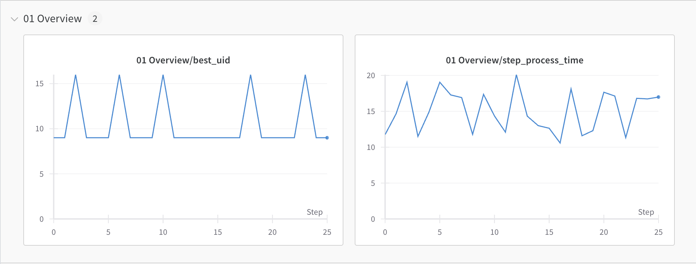
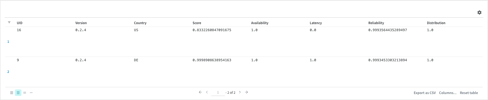
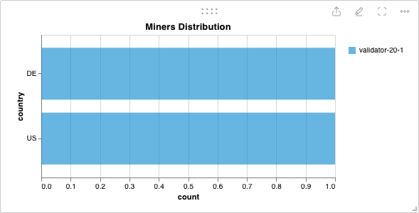
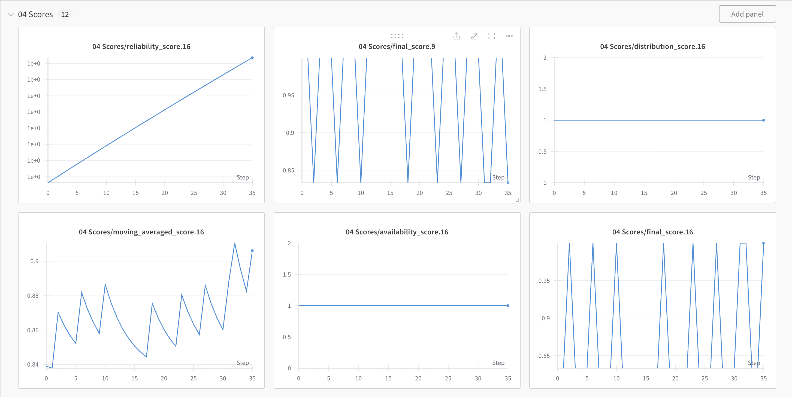
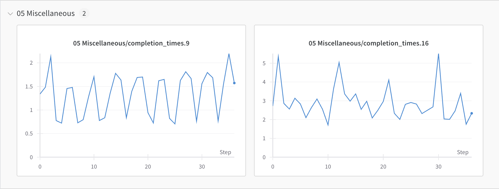
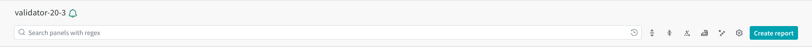
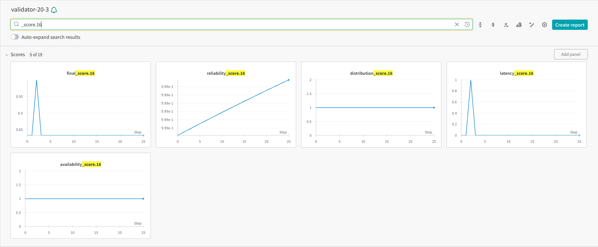

[Back to Main README](../../README.md)

This document explains how to install and configure wandb

<br />

---

- [Installation](#intasllation)
- [Configuration](#configuration)
  - [Validator](#configuration-validator)
  - [Miner](#configuration-miner)
- [User Guide](#user-guide)
- [Roadmap](#roadmap)
- [Troubleshooting](#troubleshooting)

---

<br />

# Installation

**Step 1: Installation of wandb**

This install of wandb is included when installing the SubVortex subnet (see the [guide](../../scripts/subnet/README.md) for installation details)

You can check wandb is installing by executing in **SubVortex** directory

```
pip show wandb
```

You have to see something like

```
Name: wandb
Version: 0.16.5
Summary: A CLI and library for interacting with the Weights & Biases API.
Home-page:
Author:
Author-email: Weights & Biases <support@wandb.com>
License: MIT License
```

<br />

**Step 2: Obtain Your API Key**

1. Log in to your Weights & Biases account through your web browser.
2. Go to your account settings, usually accessible from the top right corner under your profile.
3. Find the section labeled "API keys".
4. Copy your API key. It's a long string of characters unique to your account.

<br />

**Step 3: Setting Up the API Key in Ubuntu**

Log into wandb by executing

```
wandb login
```

You are going to be asked to provide your api key

```
wandb: Logging into wandb.ai. (Learn how to deploy a W&B server locally: https://wandb.me/wandb-server)
wandb: You can find your API key in your browser here: https://wandb.ai/authorize
wandb: Paste an API key from your profile and hit enter, or press ctrl+c to quit:
```

<br />

# Configuration

## Validator

The default configuration is enough to have a good user experience so there is no real need to update it.

> IMPORTANT: if you want to use wandb in testnet, please add to your validator command `--wandb.project_name` with the value `test-subvortex-team`. We separated the test and finney network for better experience.

The default configuration will create a maximum of 2 runs (active + one archive) containing 360 steps of data. We chose 360, which corresponds to an epoch, and we believe it is sufficient to understand the trend and adjust the subtensor accordingly.

Options

- `--wandb.off` - turn off wandb. Default **false**
- `--wandb.project_name` - The name of the project where you are sending the new run. Default is **subvortex-team** for mainnet and **test-subvortex-team** for testnet
- `--wandb.entity` - An entity is a username or team name where youre sending runs. Default is **eclipsevortext**
- `--wandb.offline` - Runs wandb in offline mode. Default **false**
- `--wandb.run_step_length` - How many steps before we rollover to a new run. Default **360**

To enhance user experience, we have decided to name each run using the format `validator-<VALIDATOR_UID>-<COUNT>`. This format allows users to easily identify the runs of the validator they wish to access. The count will increment with each run until it reaches 10000, at which point it will reset.

## Miner

For miner, wandb is not needed so nothing to do here.

<br />

# User Guide

To access the wandb UI to get statistics about the miners, you can click on this folling links and choose the validator run you want

- mainnet - [`subvortex-team`](https://wandb.ai/eclipsevortext/subvortex-team)
- testnet - [`test-subvortex-team`](https://wandb.ai/eclipsevortext/test-subvortex-team)

## Overview



The line plot provides valuable insights, including:

- The performance of the best miner (UID) over time.
- The step time evolution, representing the time taken for the validator to test all subtensors and compute the final score.

## Miners



The table display the list of miners with the following informations

- `UID` - UID of the miner.
- `Version` - Version of the miner.
- `Country` - Geographical location of the subtensor.
- `Score` - Last final score of the subtensor.
- `Availability` - Last availability score of the subtensor.
- `Reliability` - Last reliability score of the subtensor.
- `Latency` - Last latency score of the subtensor.
- `Distribution` - Last distribution score of the subtensor.

From that table, you can get a quick overview of how you are competing with others. You can sort the different columns to prioritize the desired information. We are still investigating if filtering is possible with Wandb.

## Distribution



The histogram gives you the number of subtensors per country. Based on how the distribution score is computed, you can easily identify a country where there are no subtensors or a very small number, in order to maximize it.

## Scores



The line plot gives you the an evolution of the score through time. There is on line plot per score (final, availability, reliability, latency and distribution) and per miner.

With these scores, you can understand how your miners compete with others and make the appropriate adjustments of your choice.

## Miscellaneous



The line plot provides valuable insights, including:

- The process time evolution, representing the time taken for the validator to get the current block from the subtensor. This time is a rwa time and does not include the tolerance based on the distance between the validator and the subtensor.

## Tips



The search bar can be use to display only the scores related to your miner. To do so, just seize in the search input `_score.<UID` and replace **UID** by your miner ID. You are going to see something like below



<br />

# Roadmap

The wandb UI is a fallback plan while waiting for the realy Frontend to be developed. We feel the need from our users to find a plan B as quick as possible and we decided to go with wandb which is already a familiar tool for our users.

In terms of our roadmap, we don't have a specific plan outlined yet, but we do have significant plans for the Frontend. Additionally, we'll be actively engaging with our users to gauge their needs and preferences. Depending on their feedback, we may need to add or modify certain graphs to ensure they have all the necessary information to understand their performance and make informed decisions accordingly.

<br />

# Troubleshooting

None
